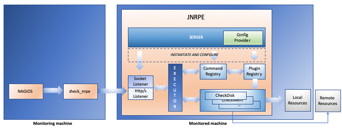

[](https://coveralls.io/github/ziccardi/jnrpe?branch=master)
# JNRPE - Java [**Nagios**](https://www.nagios.org/) Remote Plugin Executor

JNRPE allows the execution of both native and Java Nagios plugins without the overhead of a new JVM instance for each
java plugin execution.

# Overview


1. [**Nagios**](https://www.nagios.org/) will invoke a check defined as a _check_nrpe_ command.
2. **check_nrpe** will invoke the command on the JNRPE server
3. The **Socket Listener** (that implements the NRPE protocol) will parse and validate the received packet. If the packet is valid,
it will ask the **executor** to execute the received command.
4. The **executor** will ask the **Command Registry** to retrieve the command definition for the requested command
5. After receiving the command, the **executor** will ask the command definition to create a **COMMAND INSTANCE** passing 
to the command definition all the received parameters. A **COMMAND INSTANCE** will contain teh requested plugin and all the parameters (replacing the $ARGx$ macros if needed). 
6. When a **COMMAND INSTANCE** is received, the **executor** will execute the command instance and return the result to the **Socket Listener**.
7. The Socket Listener will then create a NRPE packet with the received result and will return that to **check_nrpe**.
8. **check_nrpe** returns the check result to **Nagios**

# Build the software
```bash
# ./gradlew build
```

# Run the software

```bash
# ./gradlew run
```

# Distributing
After `gradlew build` the distribution files can be found into the `it.jnrpe.server/build/distributions` folder. 
