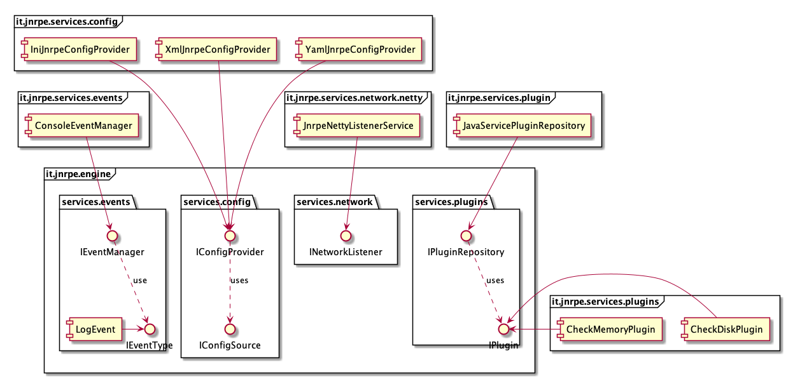

Development of the new 3.0.0 version of JNRPE has started.
Most important changes are:
* **support for Java 9 Modules:** with this new architecture, each component of JNRPE will be a module, making it very 
easy to extend JNRPE functionalities by replacing existing modules or adding new ones.
* **support for different listeners:** thanks to the modularity of the new source code, it will be very easy to add 
other listeners to the standard NRPE socket listener. For example, a REST listener could be added to provide a REST 
interface to NRPE. JNRPE v3 supports many listeners at once. 
* **JNRPE plugins as modules:** JNRPE plugins will be developed as Java 9 modules
* **support for NRPE protocol v3 and v4**

<!--truncate-->

# The modules

## The extension points
All the core extension points are into the `it.jnrpe.engine module`:
* **INetworkListener**: implementing this service will add a new listener to JNRPE. We can have more than one 
_INetworkListener_ implementations and JNRPE will discover the list of available implementations at runtime.
* **IConfigProvider**: This service must be implemented to parse a defined configuration format. By default, JNRPE provides:
    * INI configuration parser
    * XML Configuration parser
    * yaml configuration parser
* **IConfigSource**: by default JNRPE provides a filesystem configuration source. Other sources can be added to load, for
example, from a datasource or a REST service.
* **IEventManager**: JNRPE automatically dispatches all the events to all the available event managers. By default, JNRPE
provides a CONSOLE and a SLF4J event manager
* **IPluginRespository**: by default JNRPE provides a `JavaServicePluginRepository` that loads all the plugins from the
filesystem. Other implementation can be added to load the plugins in other ways.
* **IPlugin**: each class implementing this service will be a plugin available to JNRPE.

Code is still in early stage, but can be downloaded from the [github repo](https://github.com/ziccardi/jnrpe/releases/tag/3.0.0)
